# NotifyFlow - Android In-App Notifications SDK

NotifyFlow is an Android SDK for displaying dynamic in-app notifications without releasing a new app version.

The SDK allows Android applications to show **Popup** and **Banner** messages that are managed remotely from a web admin portal. Messages can be targeted by screen, country, Android version, date range, status, and max views per user. NotifyFlow also supports optional A/B Testing, analytics tracking, and offline cache fallback.

---

## 🎥 Demo Video

[](https://youtu.be/akNDc4mPfeQ)

---

## Screenshots

> Screenshots are stored under the `screenshots/` folder.  
> Some screenshots are already included below. Additional screenshots can be added later using the same file names.

### Portal Overview

<table>
  <tr>
    <td align="center" width="50%">
      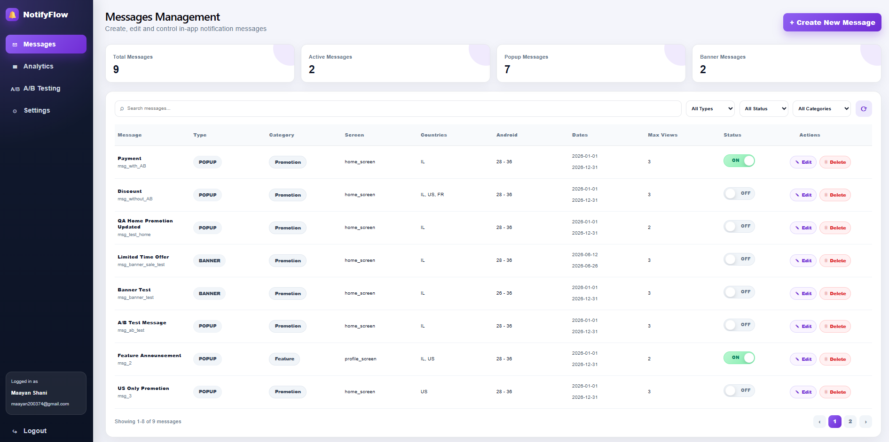
      <br />
      <b>Messages Management</b>
      <br />
      <sub>Create, edit, filter and manage notification campaigns.</sub>
    </td>
    <td align="center" width="50%">
      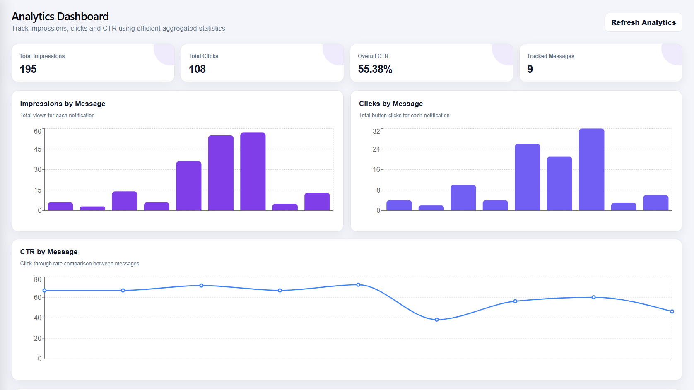
      <br />
      <b>Analytics Dashboard</b>
      <br />
      <sub>Track impressions, clicks, CTR and campaign performance.</sub>
    </td>
  </tr>
  <tr>
    <td align="center" width="50%">
      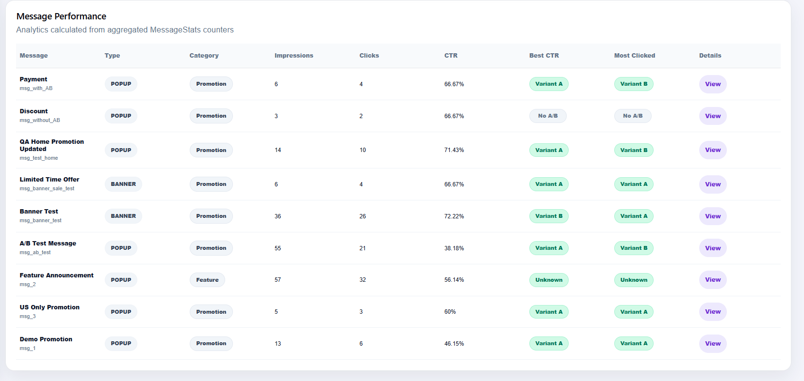
      <br />
      <b>Analytics Performance Table</b>
      <br />
      <sub>View performance per message, best CTR and most clicked variant.</sub>
    </td>
    <td align="center" width="50%">
      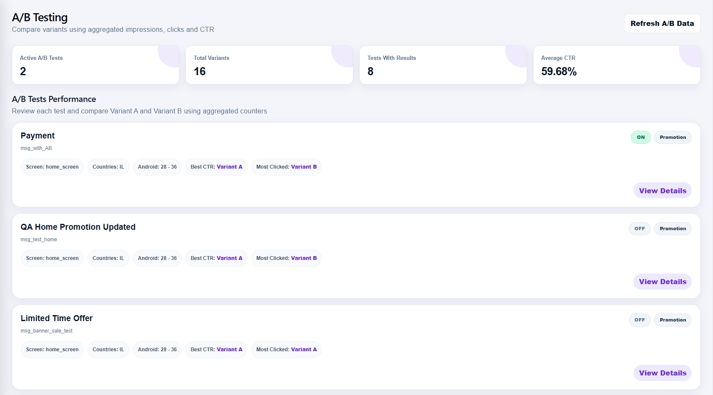
      <br />
      <b>A/B Testing Dashboard</b>
      <br />
      <sub>Compare active A/B tests and variant results.</sub>
    </td>
  </tr>
</table>

---

## Features

### Android SDK

- Simple SDK integration using `NotifyFlow.init(...)`
- Remote message loading from the backend using Retrofit
- Popup and Banner notification display
- Screen-based targeting
- Country-based targeting
- Android version targeting
- Date range validation
- Active ON/OFF message control
- Max views per user per message
- Once-per-screen-per-session behavior
- Session state separated by user, country, Android version and base URL
- Optional A/B Testing support
- Stable A/B variant selection by `userId + messageId`
- Impression and click analytics reporting
- Network-first message loading
- Offline cache fallback using SharedPreferences

### Admin Portal

- Login and register admin users
- Create, edit and delete messages
- Enable or disable messages
- Configure message type: `POPUP` / `BANNER`
- Configure category: `PROMOTION` / `FEATURE_ANNOUNCEMENT`
- Configure targeting rules
- Enable or disable A/B Testing per message
- View analytics dashboard
- View A/B Testing performance
- View message targeting details
- Real pagination in the Messages table
- Project settings and SDK integration guide

### Backend

- REST API built with Node.js and Express
- MongoDB Atlas database using Mongoose
- Message management endpoints
- SDK endpoints for message delivery and analytics events
- Efficient analytics using aggregated counters in `MessageStats`
- No raw event scanning is required for dashboard analytics

---

## Tech Stack

| Layer            | Technologies                              |
| ---------------- | ----------------------------------------- |
| Android SDK      | Kotlin, Retrofit, Gson, SharedPreferences |
| Android Demo App | Kotlin, XML layouts, Bottom Navigation    |
| Backend          | Node.js, Express.js, Mongoose             |
| Database         | MongoDB Atlas                             |
| Admin Portal     | React, Vite, Recharts, CSS                |
| Authentication   | bcryptjs                                  |
| Documentation    | Markdown, Mermaid, GitHub Pages           |

---

## System Architecture

## System Architecture

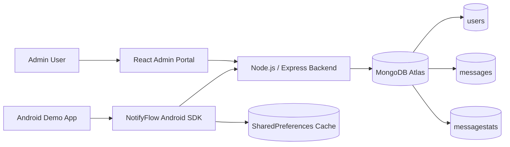

### Architecture Explanation

1. The admin creates and manages messages from the React portal.
2. The portal communicates with the Express backend.
3. The backend stores messages, admin users and analytics counters in MongoDB Atlas.
4. The Android app integrates the NotifyFlow SDK.
5. The SDK fetches relevant messages from the backend.
6. The SDK displays popup or banner notifications inside the app.
7. Impressions and clicks are reported back to the backend.
8. The backend updates aggregated analytics counters.
9. If the backend is unavailable, the SDK can load cached messages from local storage.

### Important Note About Users and Cache

The `users` collection is used only for **admin portal authentication**.  
The Android SDK does not access the `users` collection directly.

The SDK receives `userId` from the host Android app and uses it for SDK behavior such as:

- A/B variant selection
- Max views per user
- Session separation
- Analytics event reporting

The local `SharedPreferences Cache` belongs only to the Android app and is not connected to the `users` collection.

---

## Database Design

NotifyFlow uses MongoDB collections.

| Collection     | Purpose                                           |
| -------------- | ------------------------------------------------- |
| `users`        | Stores admin portal users                         |
| `messages`     | Stores notification campaigns and targeting rules |
| `messagestats` | Stores aggregated analytics counters per message  |

---

## ERD

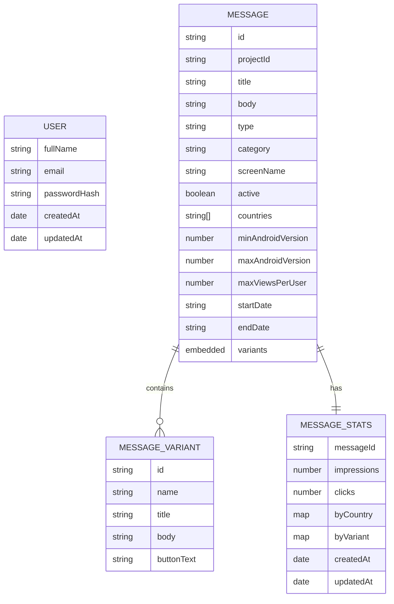

### Main Database Models

| Model            | Purpose                                                                                         |
| ---------------- | ----------------------------------------------------------------------------------------------- |
| `User`           | Stores admin portal users for login and authentication                                          |
| `Message`        | Stores notification campaigns, targeting rules, message content and optional A/B variants       |
| `MessageVariant` | Stores Variant A / Variant B content for A/B Testing                                            |
| `MessageStats`   | Stores aggregated analytics counters such as impressions, clicks, country data and variant data |

## Server Analytics Efficiency

NotifyFlow does not calculate analytics by scanning raw event logs every time the dashboard is opened.

Instead, every impression or click updates an aggregated `MessageStats` document:

- Total impressions counter
- Total clicks counter
- Per-country counters
- Per-variant counters

This makes analytics retrieval efficient because the portal reads prepared counters directly from MongoDB.

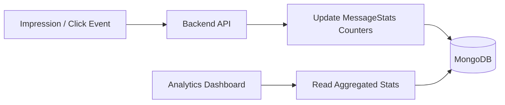

### Analytics Portal Preview

The analytics portal displays total impressions, total clicks, CTR and per-message performance using aggregated `MessageStats` counters.

<p align="center">
  
  <br />
  <b>Analytics Dashboard</b>
</p>

<p align="center">
  
  <br />
  <b>Analytics Performance Table</b>
</p>

<table>
  <tr>
    <td align="center" width="50%">
      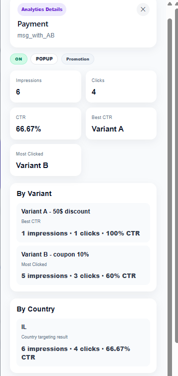
      <br />
      <b>Details Overview</b>
    </td>
    <td align="center" width="50%">
      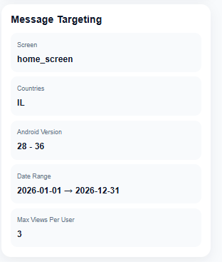
      <br />
      <b>Message Targeting</b>
    </td>
  </tr>
</table>

---

## Message Lifecycle State Diagram

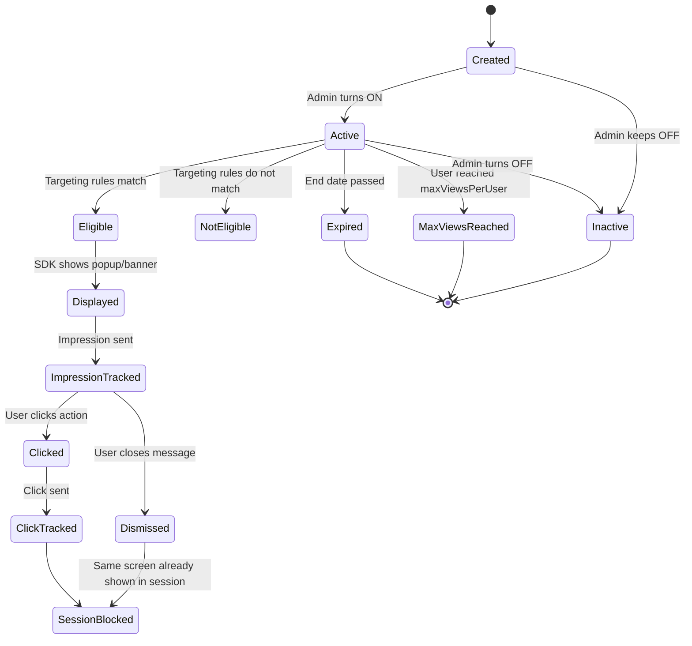

---

## Network Sequence Diagram

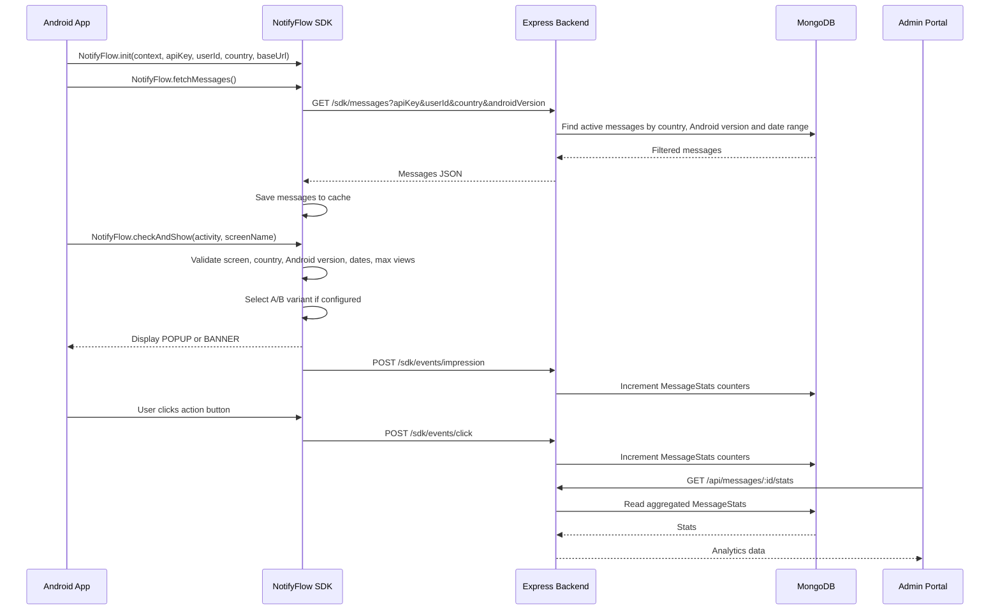

---

## SDK Installation

NotifyFlow is integrated in this project as a **local Android library module**.

The SDK module is located under:

```text
android/notifyflowlibrary
```

The demo app uses the SDK module directly from the same Android project.

### 1. Add the SDK Module

Make sure the SDK module is included in `settings.gradle.kts`:

```gradle
include(":notifyflowlibrary")
```

### 2. Add the Local Module Dependency

Add the SDK module dependency to the host app module `build.gradle.kts`:

```gradle
dependencies {
    implementation(project(":notifyflowlibrary"))
}
```

### 3. Initialize the SDK

Initialize NotifyFlow from the host Android app:

```kotlin
NotifyFlow.init(
    context = this,
    apiKey = "demo_api_key",
    userId = "user_1",
    country = "IL",
    baseUrl = "https://your-backend-url.com/"
)
```

Then fetch messages from the backend:

```kotlin
NotifyFlow.fetchMessages()
```

And check the current screen when needed:

```kotlin
NotifyFlow.checkAndShow(this, "home_screen")
```

---

## SDK Usage

Initialize the SDK once, usually from the host app activity:

```kotlin
NotifyFlow.init(
    context = this,
    apiKey = "demo_api_key",
    userId = "user_1",
    country = "IL",
    baseUrl = "https://your-backend-url.com/"
)
```

Fetch messages from the backend:

```kotlin
NotifyFlow.fetchMessages()
```

Check and show a message for the current screen:

```kotlin
NotifyFlow.checkAndShow(this, "home_screen")
```

### Demo App Screen Keys

| Screen  | Screen Key       |
| ------- | ---------------- |
| Home    | `home_screen`    |
| Profile | `profile_screen` |
| Cart    | `cart_screen`    |

When the user navigates between screens, the demo app calls:

```kotlin
NotifyFlow.checkAndShow(this, currentScreenName)
```

<table>
  <tr>
    <td align="center" width="50%">
      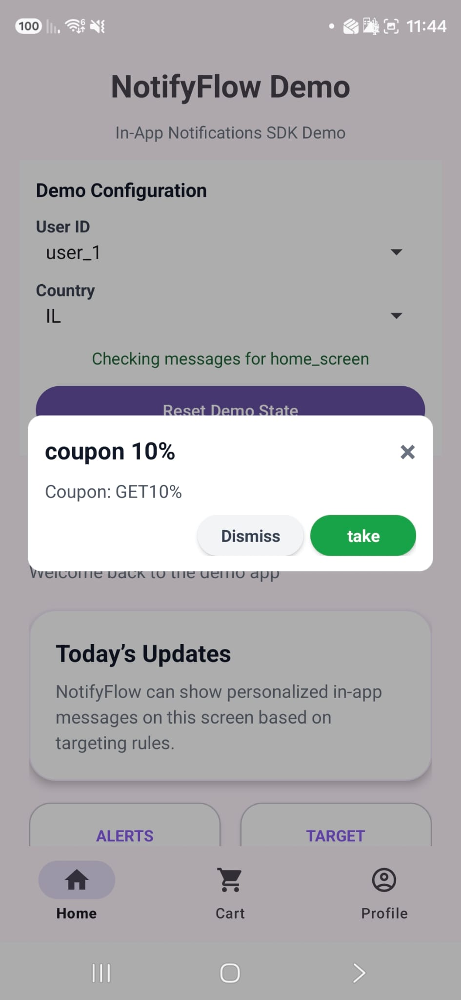
      <br />
      <b>Popup Notification</b>
      <br />
      <sub>Displayed by the SDK when a relevant popup message is found.</sub>
    </td>
    <td align="center" width="50%">
      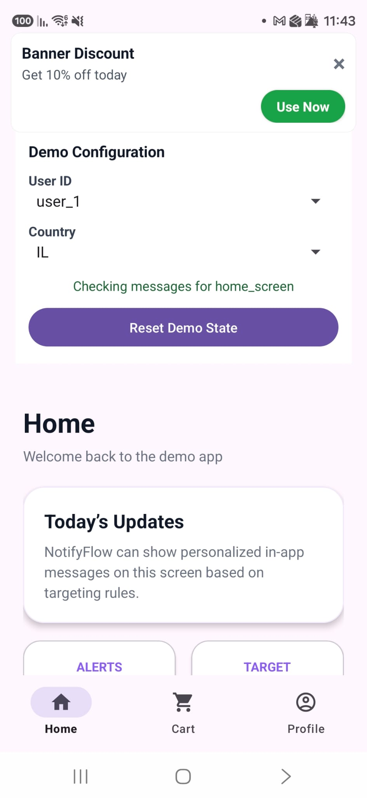
      <br />
      <b>Banner Notification</b>
      <br />
      <sub>Displayed by the SDK as an in-app banner message.</sub>
    </td>
  </tr>
</table>

---

## Public SDK API

| Function                                        | Description                                                                                  |
| ----------------------------------------------- | -------------------------------------------------------------------------------------------- |
| `NotifyFlow.init(...)`                          | Initializes the SDK with context, API key, user ID, country, backend URL and Android version |
| `NotifyFlow.fetchMessages()`                    | Loads messages from the backend and saves them to local cache after a successful response    |
| `NotifyFlow.checkAndShow(activity, screenName)` | Checks if a relevant message exists for the current screen and displays it                   |

> `NotifyFlow.resetViewsForTesting()` is included in the demo app as a QA/testing helper for resetting local view counters and session state. It is not required for normal SDK usage.

### SDK-Managed Internal Behavior

The SDK internally handles:

| Internal Logic             | Description                                                                                     |
| -------------------------- | ----------------------------------------------------------------------------------------------- |
| Message filtering          | Checks screen, country, Android version, active status and dates                                |
| Max views                  | Prevents repeated display after the user reaches the configured limit for each specific message |
| Session handling           | Prevents repeated notifications on the same screen in the same app session                      |
| A/B selection              | Selects a stable variant based on user ID and message ID                                        |
| Multiple matching messages | Skips messages that already reached max views and continues to the next eligible message        |
| Impression tracking        | Sends analytics when a message is displayed                                                     |
| Click tracking             | Sends analytics when the user clicks the message action                                         |
| Cache fallback             | Loads cached messages if the backend is unavailable                                             |

---

## Targeting Rules

A message is displayed only when all relevant conditions match:

| Rule            | Description                                                              |
| --------------- | ------------------------------------------------------------------------ |
| Active status   | Message must be ON                                                       |
| Screen name     | Message screen must match the current app screen                         |
| Country         | Current user country must be included in the message countries           |
| Android version | Current Android version must be between min and max                      |
| Date range      | Current date must be between start and end date                          |
| Max views       | User must not exceed `maxViewsPerUser`                                   |
| Session         | The same screen should not show another notification in the same session |

### Multiple Matching Messages

If several messages match the same screen, NotifyFlow checks them one by one.  
If the first matching message already reached `maxViewsPerUser`, the SDK skips it and continues to the next eligible message.

After one message is displayed on a screen, the once-per-screen-per-session rule prevents another notification from appearing on the same screen during the same app session.

---

## A/B Testing

A/B Testing is optional per message.

If A/B Testing is disabled:

- The SDK uses the regular message `title`, `body`, and default button text.

If A/B Testing is enabled:

- The message contains Variant A and Variant B.
- The SDK selects a variant using a stable hash based on `userId + messageId`.
- Impressions and clicks are tracked by variant.
- The portal compares Variant A and Variant B using impressions, clicks and CTR.

### Example Categories

| Category             | Variant A                           | Variant B                       |
| -------------------- | ----------------------------------- | ------------------------------- |
| Promotion            | `20% Discount` / `Buy Now`          | `Free Shipping` / `Use Benefit` |
| Feature Announcement | `New Feature Available` / `Try Now` | `Save Items Faster` / `Explore` |

### A/B Testing Portal Preview

<table>
  <tr>
    <td align="center" width="50%">
      
      <br />
      <b>A/B Testing Dashboard</b>
      <br />
      <sub>Summary cards and active A/B test campaigns.</sub>
    </td>
    <td align="center" width="50%">
      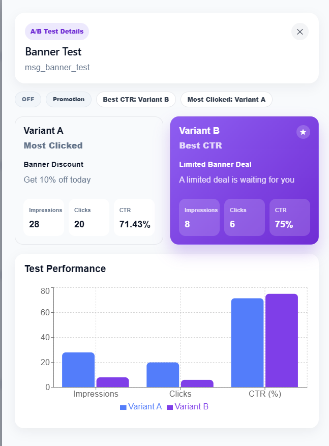
      <br />
      <b>Variant Performance Graph</b>
      <br />
      <sub>Variant A vs Variant B by impressions, clicks and CTR.</sub>
    </td>
  </tr>
</table>

---

## Cache Fallback

NotifyFlow uses a **Network First** approach:

1. The SDK first tries to fetch messages from the backend.
2. If the backend responds successfully, the SDK stores the messages in SharedPreferences cache.
3. If the backend is unavailable, the SDK attempts to load the last saved messages from cache.
4. If there is no backend and no cache, the app does not crash and no notification is displayed.

This keeps the SDK stable when the server is temporarily unavailable while still preferring updated server data when the backend is online.

---

## Message Delivery Efficiency

NotifyFlow is designed to avoid unnecessary backend requests during normal app navigation.

The SDK fetches messages from the backend on app start, when the SDK context changes, or when the app returns to the foreground. Screen navigation does not trigger a new network request. Instead, the SDK checks the already loaded messages locally using `NotifyFlow.checkAndShow(...)`.

The backend performs server-side filtering before returning messages to the SDK:

- Active status
- Country targeting
- Android version range
- Campaign date range (`startDate` / `endDate`)

After messages are loaded, the SDK performs final local validation:

- Screen matching
- Max views per user
- Once-per-screen-per-session rule
- A/B variant selection
- Cache fallback validation

This reduces network traffic, avoids unnecessary message processing on the device, and keeps portal changes synchronized through controlled refresh points instead of constant polling.

The SDK also reuses the existing Retrofit API client while the `baseUrl` remains unchanged. If the `baseUrl` changes, for example when switching between local networks, the API client is recreated for the new backend URL.

---

## Backend API Endpoints

### SDK Endpoints

| Method | Endpoint                 | Description                |
| ------ | ------------------------ | -------------------------- |
| `GET`  | `/sdk/messages`          | Loads messages for the SDK |
| `POST` | `/sdk/events/impression` | Reports an impression      |
| `POST` | `/sdk/events/click`      | Reports a click            |

### Portal Endpoints

| Method   | Endpoint                  | Description                       |
| -------- | ------------------------- | --------------------------------- |
| `GET`    | `/api/messages`           | Get all messages                  |
| `POST`   | `/api/messages`           | Create a new message              |
| `PUT`    | `/api/messages/:id`       | Update an existing message        |
| `DELETE` | `/api/messages/:id`       | Delete a message                  |
| `GET`    | `/api/messages/:id/stats` | Get analytics stats for a message |
| `POST`   | `/api/auth/register`      | Register an admin user            |
| `POST`   | `/api/auth/login`         | Login an admin user               |

### `/sdk/messages` Query Parameters

| Parameter        | Description                 |
| ---------------- | --------------------------- |
| `apiKey`         | Project API key             |
| `userId`         | Current user ID             |
| `country`        | Current user country        |
| `androidVersion` | Current Android SDK version |

The screen name is passed to the SDK through:

```kotlin
NotifyFlow.checkAndShow(this, "home_screen")
```

The backend filters by active status, country, Android version and campaign date range.  
The SDK then performs screen matching, max views validation, session validation, A/B selection and additional safety checks before displaying a message.

---

## JSON Examples

The following snippets are shortened examples based on the actual database models and SDK event structure.

### Message JSON Snippet

```json
{
  "id": "msg_new_offer",
  "type": "POPUP",
  "screenName": "home_screen",
  "countries": ["IL"],
  "maxViewsPerUser": 3
}
```

### A/B Variant JSON Snippet

```json
{
  "id": "msg_new_offer_var_a",
  "name": "A",
  "title": "20% Discount",
  "buttonText": "Buy Now"
}
```

### Analytics Event JSON Snippet

```json
{
  "messageId": "msg_new_offer",
  "variantId": "msg_new_offer_var_a",
  "userId": "user_1",
  "country": "IL",
  "eventType": "IMPRESSION"
}
```

### MessageStats JSON Snippet

```json
{
  "messageId": "msg_new_offer",
  "impressions": 12,
  "clicks": 5,
  "byCountry": {
    "IL": {
      "impressions": 8,
      "clicks": 3
    }
  }
}
```

---

## Project Structure

```text
NotifyFlow/
├── android/
│   ├── app/
│   │   └── Android demo app
│   └── notifyflowlibrary/
│       └── NotifyFlow SDK module
├── backend/
│   ├── server.js
│   └── models/
│       ├── Message.js
│       ├── MessageStats.js
│       └── User.js
├── portal/
│   ├── src/
│   │   ├── App.jsx
│   │   └── App.css
│   └── package.json
├── screenshots/
├── docs/
│   ├── index.html
│   └── style.css
└── README.md
```

---

## How to Run

### 1. Backend

```bash
cd backend
npm install
```

Create a `.env` file:

```env
MONGO_URI=your_mongodb_atlas_connection_string
PORT=3000
```

Run the backend:

```bash
node server.js
```

Optional backend health check:

```text
http://localhost:3000/health
```

---

### 2. Admin Portal

```bash
cd portal
npm install
npm run dev
```

The portal uses:

```js
const API_BASE_URL = "http://localhost:3000";
```

Open the local Vite URL shown in the terminal.

---

### 3. Android Demo App

Open the Android project in Android Studio.

Create or update the local backend URL configuration:

```properties
android/local.properties
NOTIFYFLOW_BASE_URL=http://10.0.2.2:3000/
```

Use the relevant backend URL according to your environment:

```properties
android/local.properties
NOTIFYFLOW_BASE_URL=http://10.0.2.2:3000/
```

Use the relevant backend URL according to your environment:

| Environment                 | Base URL                        |
| --------------------------- | ------------------------------- |
| Android Emulator            | `http://10.0.2.2:3000/`         |
| Real Android Device         | `http://<computer-ip>:3000/`    |
| Production / Hosted Backend | `https://your-backend-url.com/` |

Run the app and use the demo controls:

- Select user: `user_1`, `user_2`, `user_3`
- Select country: `IL`, `US`, `FR`
- Navigate between Home, Profile and Cart
- Use `Reset Demo State` for testing max views and session behavior

---

## Documentation

Explore the full NotifyFlow documentation, setup guide, architecture and SDK usage.

<a href="https://maayan-shani.github.io/NotifyFlow/">
  
</a>

---

## 👩‍💻 Author

<p align="center">
  
</p>

<p align="center">
  <a href="https://www.linkedin.com/in/maayan-shani-304269383/">
    
  </a>
  <a href="YOUR_GITHUB_LINK">
    
  </a>
</p>
